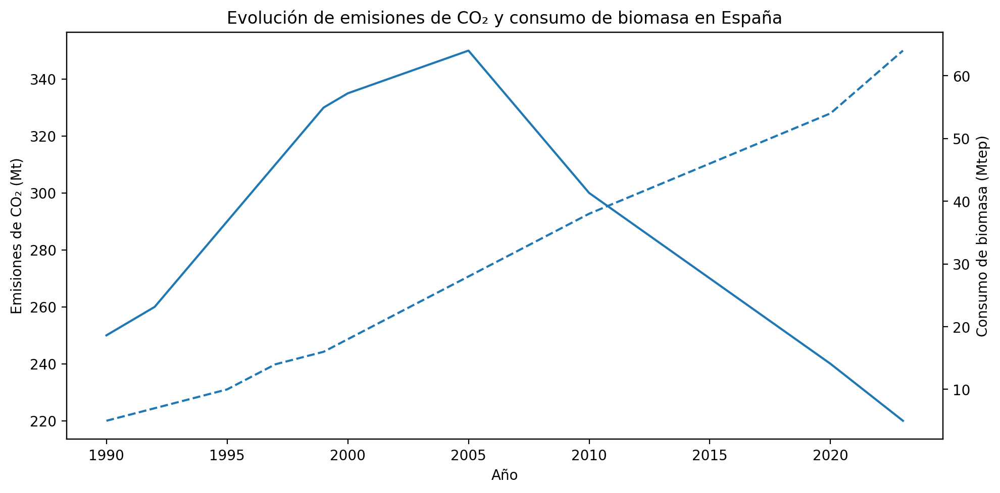

# 📊 Análisis de la contribución de la biomasa al consumo energético en España y su impacto en emisiones de CO₂

**Autora:** María José Sánchez Herrero  
📍 Sevilla, España  
📧 mjsherrero26@gmail.com  

---

## 📌 Descripción
Este repositorio contiene un análisis exploratorio sobre la evolución del consumo de biomasa en España y su relación con la reducción de emisiones de CO₂.  

El objetivo es evaluar tendencias y posibles correlaciones entre ambas variables a partir de datos abiertos.

---

## 📂 Estructura del repositorio

---

## 📈 Resultados preliminares
A continuación se muestra un gráfico de la evolución conjunta:

---

## 📚 Fuentes de datos
- [Our World in Data](https://ourworldindata.org/)  
- [Eurostat](https://ec.europa.eu/eurostat)  
